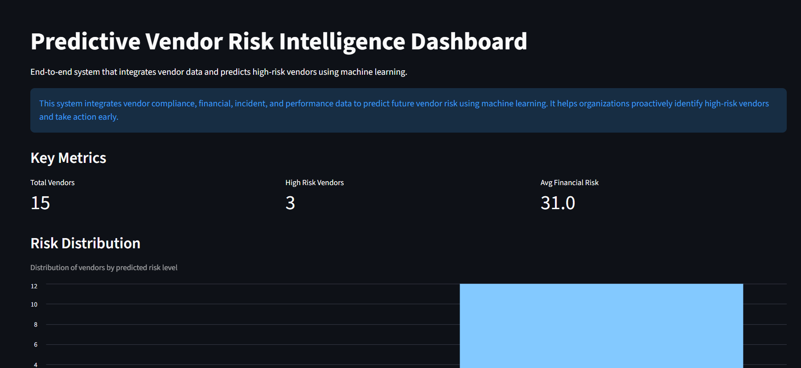
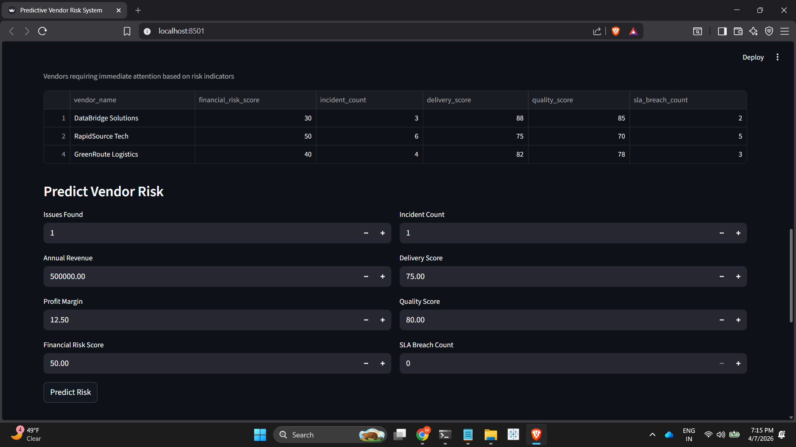

# Predictive Vendor Risk Intelligence Dashboard
💡 Proactively identifies high-risk vendors to reduce operational and financial risks.
## 🚀 Project Highlights
- Built an end-to-end vendor risk intelligence system using real-world metrics
- Implemented machine learning model for risk prediction
- Designed interactive Streamlit dashboard for decision-making
- Identified high-risk vendors using multi-factor scoring

End-to-end vendor risk intelligence system that integrates compliance, financial, incident, and performance data to predict high-risk vendors using machine learning.

---

## 📌 Live Demo
https://vendor-risk-dashboard.streamlit.app

---

## 📷Dashboard Overview


## 🤖 Model Evaluation


## 🚨 High Risk Vendors


## 🔮 Risk Prediction


---

## 📌 Problem Statement

Vendor risk is often identified **reactively**, after issues occur.  
Organizations need a system that can:

- Consolidate vendor data from multiple sources  
- Identify high-risk vendors early  
- Support data-driven decision-making  

---

## 💡 Solution

This project builds a **Predictive Vendor Risk Intelligence System** that:

- Integrates vendor **compliance, financial, incident, and performance data**
- Applies **feature engineering and risk logic**
- Trains a **machine learning model** to predict high-risk vendors
- Provides an **interactive Streamlit dashboard** for real-time analysis

---

## 🧱 Architecture

Multiple Data Sources → Data Integration → Feature Engineering → ML Model → Streamlit Dashboard

---

## 📊 Key Features

- Multi-source data integration (CSV datasets)
- Vendor risk scoring logic
- Machine learning model (Logistic Regression)
- Risk prediction with probability
- Interactive dashboard using Streamlit
- Visualization of risk distribution
- Identification of high-risk vendors
- Model evaluation using confusion matrix

---

## 🛠️ Tech Stack

- Python  
- Pandas, NumPy  
- Scikit-learn  
- Streamlit  
- Matplotlib / Seaborn  
- Joblib  

---

## 🚀 How to Run the Project

### 1. Clone the repository
```bash
git clone https://github.com/nathmimansa15-code/vendor-risk-dashboard.git
cd vendor-risk-dashboard
